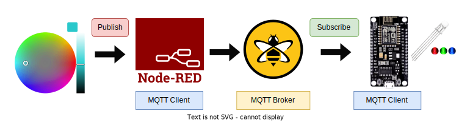
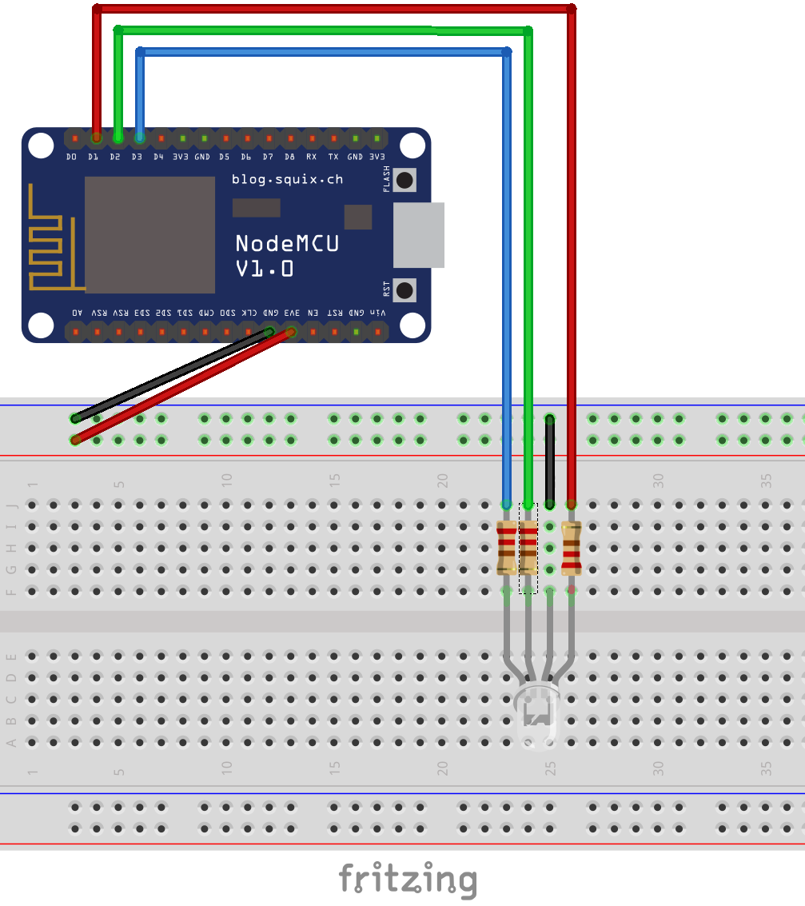
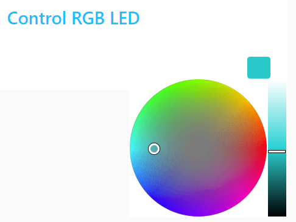

# Control_RGB_LED_using_MQTT_NodeRED_Dashboard
Control RGB LED using MQTT and NodeRED Dashboard using NodeMCU

## Flow diagram of the Project



### Step 1: Install the Required Libraries
- Open an Arduino IDE --> Tools --> Manage Libraries
- Search and install the following libraries
    ```
    "pubsubclient" by Nick
    "ArduinoJson" by Benoit
    ```

### Step 2: Hardware Schematic
- NodeMCU development board
- RGB LED - Common Cathode
- 3 x 220 ohm Resistors
- Breadboard
- Jumper wires 


### Step 3: Running the program
- Copy the code to the Arduino IDE
- Setup the Board and Port
- Connect the NodeMCU to the USB port of the computer
- Upload the code
- Monitor the values in the Serial monitor

### Step 4: Setup the Node-RED flow

- Open Node-RED URL in the browser
- Click on Menu --> Manage Palette
- Search for "node-red-dashboard" and install it. 
- Import the flow using the following code

```
[{"id":"5dc1161fc5c667c3","type":"tab","label":"Control LED","disabled":false,"info":"","env":[]},{"id":"d642b8f1757fe253","type":"mqtt out","z":"5dc1161fc5c667c3","name":"","topic":"iotfrontier/color","qos":"0","retain":"true","respTopic":"","contentType":"","userProps":"","correl":"","expiry":"","broker":"6ec4dcef.913b24","x":480,"y":160,"wires":[]},{"id":"8ea75bd89213cbf9","type":"ui_colour_picker","z":"5dc1161fc5c667c3","name":"","label":"","group":"98d34422949a2369","format":"rgb","outformat":"object","showSwatch":true,"showPicker":false,"showValue":false,"showHue":false,"showAlpha":false,"showLightness":true,"square":"false","dynOutput":"false","order":0,"width":0,"height":0,"passthru":true,"topic":"topic","topicType":"msg","className":"","x":130,"y":160,"wires":[["d642b8f1757fe253","a42c7d89cf6c0dbe"]]},{"id":"a42c7d89cf6c0dbe","type":"debug","z":"5dc1161fc5c667c3","name":"debug 2","active":true,"tosidebar":true,"console":false,"tostatus":false,"complete":"false","statusVal":"","statusType":"auto","x":460,"y":240,"wires":[]},{"id":"6ec4dcef.913b24","type":"mqtt-broker","name":"","broker":"broker.hivemq.com","port":"1883","clientid":"","autoConnect":true,"usetls":false,"protocolVersion":"4","keepalive":"15","cleansession":true,"birthTopic":"","birthQos":"0","birthPayload":"","birthMsg":{},"closeTopic":"","closePayload":"","closeMsg":{},"willTopic":"","willQos":"0","willPayload":"","willMsg":{},"userProps":"","sessionExpiry":""},{"id":"98d34422949a2369","type":"ui_group","name":"Control RGB LED","tab":"903fa3e2969e67a7","order":3,"disp":true,"width":"6","collapse":false,"className":""},{"id":"903fa3e2969e67a7","type":"ui_tab","name":"Dashboard","icon":"dashboard","disabled":false,"hidden":false}]
```
- Deploy the flow
- Navigate to the following URL and modify the <your IP address>. For example http://localhost:1880/ui
```
http://<your IP address>:1880/ui
```
- Control the color using color picker in the Dashboard as below
  


